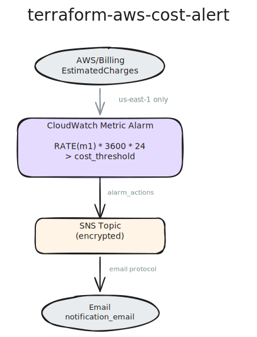

# terraform-aws-cost-alert

[](https://infrahouse.com/contact)
[](https://infrahouse.github.io/terraform-aws-cost-alert/)
[](https://registry.terraform.io/modules/infrahouse/cost-alert/aws/latest)
[](https://github.com/infrahouse/terraform-aws-cost-alert/releases/latest)
[](https://aws.amazon.com/cloudwatch/)
[](https://aws.amazon.com/sns/)
[](https://github.com/infrahouse/terraform-aws-cost-alert/actions/workflows/checkov.yml)
[](LICENSE)

The module creates a CloudWatch alarm to monitor AWS daily cost and sends
notifications to an email via SNS.

The module must be deployed in **us-east-1** because the billing metric is
maintained only in this region.

Billing alerts must be
[enabled explicitly](https://docs.aws.amazon.com/AmazonCloudWatch/latest/monitoring/monitor_estimated_charges_with_cloudwatch.html#turning_on_billing_metrics)
before using this module.

When the alarm is created, check your inbox -- AWS will send a subscription
confirmation request that must be accepted.

## Features

- CloudWatch metric alarm based on estimated daily cost rate
- SNS topic with encryption at rest for alert notifications
- Email subscription for cost alerts
- Configurable cost threshold and evaluation period

## Architecture



## Quick Start

```hcl
module "cost_alert" {
  source  = "registry.infrahouse.com/infrahouse/cost-alert/aws"
  version = "1.1.1"

  cost_threshold     = 20
  notification_email = "alerts@example.com"
}
```

## Documentation

Full documentation is available at
[https://infrahouse.github.io/terraform-aws-cost-alert/](https://infrahouse.github.io/terraform-aws-cost-alert/).

## Requirements

- Terraform >= 1.5
- AWS provider >= 5.56, < 7.0
- Must be deployed in `us-east-1`
- [Billing alerts enabled](https://docs.aws.amazon.com/AmazonCloudWatch/latest/monitoring/monitor_estimated_charges_with_cloudwatch.html#turning_on_billing_metrics)

## Usage

<!-- BEGIN_TF_DOCS -->

## Requirements

| Name | Version |
|------|---------|
| <a name="requirement_terraform"></a> [terraform](#requirement\_terraform) | ~> 1.5 |
| <a name="requirement_aws"></a> [aws](#requirement\_aws) | >= 5.56, < 7.0 |

## Providers

| Name | Version |
|------|---------|
| <a name="provider_aws"></a> [aws](#provider\_aws) | >= 5.56, < 7.0 |

## Modules

No modules.

## Resources

| Name | Type |
|------|------|
| [aws_cloudwatch_metric_alarm.periodic_cost](https://registry.terraform.io/providers/hashicorp/aws/latest/docs/resources/cloudwatch_metric_alarm) | resource |
| [aws_sns_topic.cost_notifications](https://registry.terraform.io/providers/hashicorp/aws/latest/docs/resources/sns_topic) | resource |
| [aws_sns_topic_subscription.cost_emails](https://registry.terraform.io/providers/hashicorp/aws/latest/docs/resources/sns_topic_subscription) | resource |

## Inputs

| Name | Description | Type | Default | Required |
|------|-------------|------|---------|:--------:|
| <a name="input_alert_name"></a> [alert\_name](#input\_alert\_name) | Alert name | `string` | `"AWS daily cost"` | no |
| <a name="input_cost_threshold"></a> [cost\_threshold](#input\_cost\_threshold) | Notify if estimated daily cost is greater than this value. | `number` | n/a | yes |
| <a name="input_environment"></a> [environment](#input\_environment) | Environment name (e.g., development, staging, production). | `string` | n/a | yes |
| <a name="input_notification_email"></a> [notification\_email](#input\_notification\_email) | Email that will receive alert notifications. | `string` | n/a | yes |
| <a name="input_period_hours"></a> [period\_hours](#input\_period\_hours) | Evaluation period in hours. Must evenly divide 24.<br/>Valid values: 1, 2, 3, 4, 6, 8, 12, 24. | `number` | `12` | no |

## Outputs

| Name | Description |
|------|-------------|
| <a name="output_cloudwatch_alarm_arn"></a> [cloudwatch\_alarm\_arn](#output\_cloudwatch\_alarm\_arn) | ARN of the CloudWatch metric alarm for daily cost. |
| <a name="output_sns_topic_arn"></a> [sns\_topic\_arn](#output\_sns\_topic\_arn) | ARN of the SNS topic for cost alert notifications. |
<!-- END_TF_DOCS -->

## Examples

See the [test_data/cost-alert/](test_data/cost-alert/) directory for a
working example.

## Contributing

See [CONTRIBUTING.md](CONTRIBUTING.md) for contribution guidelines.

## License

[Apache 2.0](LICENSE)
